# 🔬 ARES: Autonomous Research & Multi-Agent Evaluation Engine

[](https://www.python.org/)
[](https://github.com/langchain-ai/langgraph)
[](https://build.nvidia.com/)
[](https://ollama.com/)
[](LICENSE)

ARES is a **stateful, graph-orchestrated multi-agent research engine** built on top of [LangGraph](https://github.com/langchain-ai/langgraph). Unlike simple linear, one-shot AI scripts that fail silently or lack resilience, ARES simulates a real-world research team: it dynamically generates distinct analyst personas, subjects them to interactive human feedback, runs parallel search-grounded expert interviews, and synthesizes the findings into a cited, comprehensive markdown report.

---

## 💡 What Makes ARES Different?

Most AI-based search tools work as black boxes: you enter a query, wait, and get a generic summary. If a search query is off-topic or a tool crashes, the entire run is lost.

ARES tackles this with a highly **resilient, human-in-the-loop, and parallel graph architecture**:

*   **Stateful Autonomy with SQLite Persistence:** Runs are backed by a persistent SQLite database. The engine can pause, await human review, and resume from checkpoints without losing state.
*   **Parallel Map-Reduce Fan-Out:** Orchestrates multiple independent AI analyst personas in parallel (Map step), each interviewing a context-grounded AI expert. The engine then synthesizes their findings (Reduce step).
*   **Grounded expert Q&A (No Hallucinations):** The AI experts are restricted to retrieved context (Wikipedia + DuckDuckGo/Tavily) and must cite references inline (e.g., `[1]`, `[2]`).
*   **Aesthetic Terminal Experience:** Fully driven by a rich terminal interface featuring live status spinners, colored panels for Q&A, structured tables, and real-time Markdown rendering.

---

## 🏗️ Multi-Agent Architecture

The orchestration logic is structured into four distinct phases, visualized in the workflow diagram below:

```mermaid
graph TD
    %% Phase 1: Analyst Generation
    START([START]) --> create_analysts["Phase 1: Create Analysts<br/><i>(Generate Persona Set)</i>"]
    create_analysts --> human_feedback{"human_feedback<br/><i>(Interrupt Checkpoint)</i>"}
    
    %% Phase 1 Feedback Loops
    human_feedback -- "Provide Edits / Refinement" --> create_analysts
    human_feedback -- "Press Enter (Accept)" --> conduct_interview["Phase 2 & 3: Map Phase<br/><i>(Parallel Analyst Interviews)</i>"]
    
    %% Phase 2: Sub-Graph (Fanned-Out)
    subgraph "Phase 2: Analyst Q&A Sub-Graph (Per Persona)"
        direction TB
        sub_start([START]) --> ask_question["ask_question<br/><i>(Analyst Formulates Q)</i>"]
        ask_question --> continue_or_finish{"continue_or_finish?"}
        continue_or_finish -- "Keep Interviewing" --> search_context["search_context<br/><i>(Query Wikipedia & Web)</i>"]
        search_context --> answer_question["answer_question<br/><i>(Expert Answers using Context)</i>"]
        answer_question --> route_messages{"route_messages?"}
        route_messages -- "Under Turn Cap" --> ask_question
        route_messages -- "Turn Cap Reached" --> save_interview["save_interview"]
        continue_or_finish -- "Analyst Signed Off" --> save_interview
        save_interview --> write_section["write_section<br/><i>(Generate Cited Memo)</i>"]
        write_section --> sub_end([END])
    end
    
    %% Phase 3: Reduce Phase
    conduct_interview --> write_report["write_report<br/><i>(Synthesize Body)</i>"]
    conduct_interview --> write_introduction["write_introduction<br/><i>(Write Intro)</i>"]
    conduct_interview --> write_conclusion["write_conclusion<br/><i>(Write Conclusion)</i>"]
    
    write_report --> finalize_report["finalize_report<br/><i>(Stitch Final Document)</i>"]
    write_introduction --> finalize_report
    write_conclusion --> finalize_report
    
    finalize_report --> END([END])

    classDef phaseStyle fill:#1e1e2f,stroke:#4f46e5,stroke-width:2px,color:#fff;
    classDef graphStyle fill:#111827,stroke:#1f2937;
    class create_analysts,conduct_interview,write_report,write_introduction,write_conclusion,finalize_report phaseStyle;
```



---

## 🚀 Live Demo Walkthrough

ARES includes a gorgeous interactive command-line interface (CLI) powered by the `rich` library. Here is a preview of the CLI lifecycle:

### 1. Topic & Persona Generation
When started, ARES asks for a research topic and dynamically creates diverse analyst perspectives (e.g., policy analysts, economic advisors, field experts) to cover all angles of the topic.

```text
 ╭────────────────────────────────────────────────────────╮
 │ 🔬 ARES                                                │
 │ Autonomous Research & Multi-Agent Evaluation Engine    │
 ╰────────────────────────────────────────────────────────╯
🔍 Research topic: Renewable energy integration in microgrids
[dim]Run · thread_id=9f2a0b1c · analysts=3 · turns/interview=3[/]

🧑‍🔬 3 Analyst(s) Generated
 ╭───┬──────────────────┬───────────────────┬────────────────────┬──────────────────────────────────────────╮
 │ # │ Name             │ Role              │ Affiliation        │ Focus                                    │
 ├───┼──────────────────┼───────────────────┼────────────────────┼──────────────────────────────────────────┤
 │ 1 │ Dr. Elena Vance  │ Grid Architect    │ NREL               │ Grid stability, load balancing, storage  │
 │ 2 │ Marcus Aurelius  │ Financial Officer │ CleanTech Capital  │ CapEx/OpEx, ROI, and economic viability  │
 │ 3 │ Sarah Jenkins    │ Policy Lead       │ Energy Transition  │ Regulatory frameworks and subsidies     │
 ╰───┴──────────────────┴───────────────────┴────────────────────┴──────────────────────────────────────────╯

✏️  Feedback for analysts (Enter to accept): _
```

### 2. Live Q&A Stream
Once you accept the analyst personas (or press Enter to proceed), ARES kicks off the parallel interviews. The CLI streams the live questions and expert answers, complete with formatting and search logs.

```text
🎙️  Interviews & Report Synthesis
────────────────────────────────────────────────────────────────────────
🔍 Searching sources (Wikipedia + web)...
[Wikipedia] ✅ Found 2 docs for: 'Microgrid battery storage ROI'
[Web] ✅ duckduckgo returned 3 results for: 'Microgrid battery storage ROI'

╭─ 🎤 Analyst Question (Marcus Aurelius) ────────────────────────────────╮
│ What is the typical return on investment period for lithium-ion        │
│ battery energy storage systems integrated into remote microgrids?      │
╰────────────────────────────────────────────────────────────────────────╯

╭─ 💬 Expert Answer ─────────────────────────────────────────────────────╮
│ Based on NREL's 2025 assessment [1], the ROI period for remote         │
│ microgrid battery storage ranges between 4.8 to 7.2 years, heavily     │
│ dependent on local diesel fuel displacement offsets [2].               │
╰────────────────────────────────────────────────────────────────────────╯
```

---

## 🛠️ Setup & Installation

### Prerequisites
*   Python 3.10 or higher.
*   An active LLM Provider account (either **NVIDIA NIM API Key** or a local **Ollama** server running).

### 1. Clone & Install Dependencies
```bash
# Clone the repository
git clone https://github.com/yourusername/ARES.git
cd ARES

# Install required packages
pip install -r requirements.txt
```

### 2. Configure Environment
Create a `.env` file in the root directory:
```env
# Choose LLM Provider: "nvidia" (default) or "ollama"
LLM_PROVIDER="nvidia"

# NVIDIA NIM Configuration (if using nvidia)
NVIDIA_API_KEY="your_nvidia_api_key_here"
NVIDIA_MODEL="meta/llama-3.3-70b-instruct"

# Ollama Configuration (if using ollama)
# OLLAMA_MODEL="llama3.1:8b"

# Persistence & Checkpointing Backend: "sqlite" (default) or "memory"
CHECKPOINT_BACKEND="sqlite"
CHECKPOINT_DB="ares_checkpoints.sqlite"

# Web Search Provider: "duckduckgo" (default, keyless) or "tavily"
SEARCH_BACKEND="duckduckgo"
# TAVILY_API_KEY="your_tavily_api_key_here" (if using tavily)

# Search limitations
WEB_MAX_RESULTS=3
MAX_SOURCES_FOR_EXPERT=5
MAX_SOURCE_CHARS=1500
```

---

## ⚡ Running ARES

ARES supports multiple execution modes via command-line arguments:

### A. Fully Interactive Mode (Default)
Enter your topic, review personas, and provide feedback interactively:
```bash
python ARES.py
```

### B. Non-Interactive Mode
Skip human feedback checkpoints and run the research process end-to-end automatically (great for pipelines or scripting):
```bash
python ARES.py --topic "Artificial Intelligence in Agriculture" --no-feedback
```

### C. Resuming an Interrupted Run
Since ARES uses persistent state checkpoints, you can resume an interrupted session by specifying its previous `thread_id`:
```bash
python ARES.py --thread-id "9f2a0b1c"
```

### D. Adjusting Research Depth
Customize the number of analysts generated and the depth of the interviews:
```bash
python ARES.py --max-analysts 4 --max-turns 4 --output "ai_report.md"
```

---

## 🐳 Running with Docker

ARES ships with a slim, non-root container image so you can run it without a local
Python setup. Configuration is injected at runtime — **no secrets are baked into the
image** — and generated reports plus SQLite checkpoints persist in a named volume.

### 1. Configure
```bash
cp .env.example .env      # then edit .env and add your NVIDIA_API_KEY
```

### 2A. Build & run with Docker
```bash
# Build the image
docker build -t ares:latest .

# Run a research job (persist artefacts in the `ares_data` volume)
docker run --rm -it --env-file .env -v ares_data:/data \
  ares:latest --topic "Artificial Intelligence in Agriculture" --no-feedback
```
The finished report is written to `/data/research_report.md` inside the volume.

### 2B. Or use Docker Compose
```bash
# NVIDIA NIM provider (default) — reads keys from .env
docker compose run --rm ares --topic "AI in Agriculture" --no-feedback
```

Run **fully locally** (no API key) with the bundled Ollama sidecar:
```bash
docker compose --profile local up -d ollama
docker compose exec ollama ollama pull llama3.1:8b
LLM_PROVIDER=ollama OLLAMA_HOST=http://ollama:11434 \
  docker compose run --rm ares --topic "AI in Agriculture" --no-feedback
```

> **Note:** the interactive persona-feedback prompt needs a TTY. Use `docker run -it`
> or `docker compose run` (both allocate one). For headless / CI pipelines, pass
> `--no-feedback` to skip the human-in-the-loop checkpoint.

---

## 📁 Repository Structure

```text
├── ARES.py                  # Core logic, State Graphs, and CLI driver
├── requirements.txt         # Package dependencies
├── Dockerfile               # Container image (slim, non-root)
├── docker-compose.yml       # Compose stack (ARES + optional Ollama sidecar)
├── .dockerignore            # Build-context excludes (keeps secrets out)
├── .env.example             # Template for the runtime configuration
├── research_report.md       # Default output path for the finalized report
├── ares_checkpoints.sqlite  # SQLite database storing run states & history
├── academic/                # Research paper (LaTeX + Markdown) & figures
└── LICENSE                  # Project License
```

---

## 🛡️ License

This project is licensed under the MIT License - see the [LICENSE](LICENSE) file for details.